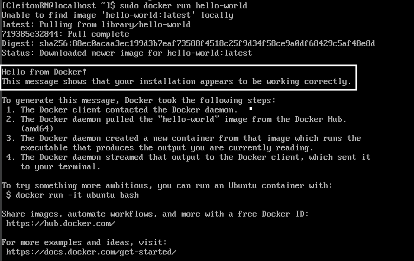

<p align="center">
  <a href="" rel="noopener">
 </a>
</p>

<h1 align="center">Instalando Docker em uma VM Oracle Linux</h1> 
<p align="center"><i>Passo a passo de como instalar o Docker em uma VM Oracle Linux (RedHat)</i></p>

## 📝 Tabela de conteúdos
- [Instalando tudo que é necessário (Passo 1)](#step1)
- [Inicializando o Docker (Passo 2)](#step2)
- [Referências](#documentation)

## 🖥️ Instalando tudo que é necessário (Passo 1)<a name = "step1"></a>

### Atualizando o sistema
- Execute o seguinte comando:
    ```
    sudo dnf update
    ```
    
- Se houver atualizações do kernel, considere reiniciar a máquina com:

    ```
    sudo reboot
    ```

### Instalando Docker na VM01

- Instalando a partir de um repositório RPM
- Para começar, instale o pacote **yum-utils** (que fornece o **yum-config-manager** como utilitário) e configure o repositório.

    ```
    $ sudo yum install -y yum-utils
    $ sudo yum-config-manager --add-repo https://download.docker.com/linux/centos/docker-ce.repo
    ```

#### Instalando o Docker Engine

- Para instalar a versão mais recente utilize esse comando:

    ```
    $ sudo yum install docker-ce docker-ce-cli containerd.io docker-buildx-plugin docker-compose-plugin --allowerasing --nobest
    ```

    - Observações: Se for solicitado a aceitar a chave GPG, verifique se a impressão digital corresponde "060A 61C5 1B55 8A7F 742B 77AA C52F EB6B 621E 9F35" e, em caso afirmativo, aceite-a.
    
    - Além disso, este comando instala o Docker, mas não inicia o Docker. Ele também cria um grupo "docker", mas não adiciona nenhum usuário ao grupo por padrão.

## ⚙️ Inicializando o Docker <a name = "step2"></a>

- Inicie o Docker.

    ```
    $ sudo systemctl start docker
    ```

- Verifique se a instalação do Docker Engine foi bem-sucedida executando a imagem 'hello-world'.

    ```
    $ sudo docker run hello-world
    ```

- Depois de executar o comando, você verá essa mensagem:

    

- ### Instalação concluída com sucesso.

## Referências utilizadas:<a name="documentation"></a>
[Documentação Docker - Instalação para CentOS](https://docs.docker.com/engine/install/centos/)